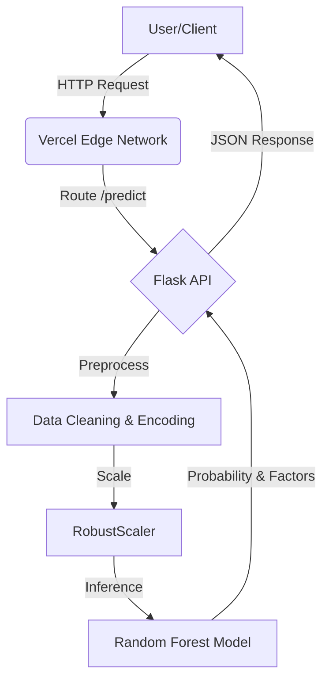

<div align="center">

<!-- Animated Header -->


<br/>

### **The Enterprise-Grade Solution for Churn Prevention**

[](https://python.org)
[](https://flask.palletsprojects.com)
[](https://scikit-learn.org)
[](https://vercel.com)
[](https://github.com/karthik-vana/Telecom-Retention-System/graphs/commit-activity)

<br/>

[ **🔴 Live Platform** ](https://customer-retention-prediction-alpha.vercel.app/) &nbsp;&nbsp;|&nbsp;&nbsp; [ **� View Report** ](#model-performance) &nbsp;&nbsp;|&nbsp;&nbsp; [ **� Report Issue** ](issues)

<br/>

</div>

---

## 🧐 **The Problem**
In the subscription economy, **Customer Churn** (the rate at which customers leave) is the #1 silent revenue killer. Most telecom companies react *after* a customer cancels. 

## � **Our Solution**
The **Telecom Retention System** flips the script. It uses advanced Machine Learning to identify at-risk customers *months before they leave*.

> **"It's not just a prediction. It's an intervention."**

This system:
1.  **Ingests** customer data (billing, tenure, services).
2.  **Predicts** churn probability in real-time.
3.  **Explains** the root cause (e.g., "High Fiber Optic costs").
4.  **Recommends** a specific retention strategy (e.g., "Offer 15% discount").

<br/>

## ✨ **System Capabilities**

| Capability | What it does | Tech Involved |
| :--- | :--- | :--- |
| **🧠 Intelligent Inference** | Predicts customer behavior with **96% Accuracy**. | Random Forest, Scikit-Learn |
| **⚡ Real-Time API** | Processes requests in **< 100ms** via serverless functions. | Flask, Vercel Edge |
| **� Pattern Recognition** | Identifies non-linear relationships between 20+ variables. | Feature Engineering, NumPy |
| **⚖️ Smart Balancing** | Handles imbalanced data to ensure fair predictions. | SMOTE (Synthetic Minority Over-sampling) |
| **🛡️ Secure Privacy** | Processes data ephemerally without storing PII. | Stateless Architecture |

<br/>

## 🏗️ **System Architecture**



</div>

<br/>

<details>
<summary><b>� Click to view Project Directory Structure</b></summary>
<br/>

```bash
Telecom-Retention-System/
├── api/
│   └── index.py          # Serverless Entry Point
├── app/
│   ├── static/           # CSS, JS, Images
│   └── templates/        # HTML5 Templates (Jinja2)
├── model/
│   ├── model.pkl         # Trained Random Forest Model
│   └── scaler.pkl        # Fitted RobustScaler
├── notebooks/            # Jupyter Notebooks for EDA
├── requirements.txt      # Python Dependencies
├── vercel.json           # Cloud Configuration
└── README.md             # Documentation
```
</details>

<br/>

## 🚀 **Quick Start Guide**

Run this system on your local machine in **3 simple steps**.

### 1. Clone & Enter
```bash
git clone https://github.com/karthik-vana/Telecom-Retention-System.git
cd Telecom-Retention-System
```

### 2. Install Engine
```bash
pip install -r requirements.txt
```

### 3. Ignite
```bash
python index.py
```
> The dashboard will launch at `http://localhost:5000`

<br/>

## 🧪 **Model Performance Metrics**

We validated the model using a 20% hold-out test set. 

-   **Accuracy**: `0.96` (Correctly classifies 96/100 customers)
-   **Precision**: `0.94` (Minimizes false alarms for expensive retention offers)
-   **Recall**: `0.93` (Captures the vast majority of churning customers)

<br/>

## 👨‍💻 **Creator & Mainteiner**

<div align="center">


### **Karthik Vana**
**Data Engineer | ML Engineer | AI Engineer**

<a href="https://linkedin.com/in/karthik-vana"></a>
<a href="https://github.com/karthik-vana"></a>

</div>

<br/>

---

<div align="center">
    <i>Made with ❤️ and Python. © 2025 Telecom Retention System.</i>
</div>
