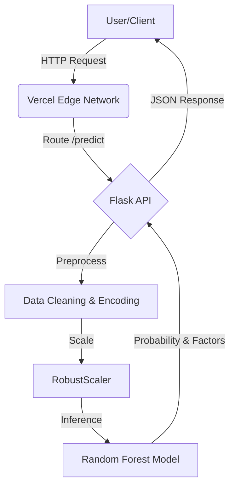

<div align="center">

# ⚡ Telecom Retention System
### Advanced AI-Powered Customer Intelligence Platform

[](https://python.org)
[](https://flask.palletsprojects.com)
[](https://scikit-learn.org)
[](https://vercel.com)
[](LICENSE)

<br/>

**A Next-Generation Machine Learning System that predicts, analyzes, and prevents customer churn in real-time.**

[ **🔴 Live Demo** ](https://customer-retention-prediction-alpha.vercel.app/)  |  [ **📖 Documentation** ](#documentation)  |  [ **🐞 Report Bug** ](issues)

<br/>

---


*(Note: Replace with actual screenshot of your stunning UI)*

</div>

<br/>

## 🚀 **Overview**

The **Telecom Retention System** is not just a predictive model; it is a full-stack intelligence platform designed for the telecom industry. It leverages historical customer data (billing, demographics, service usage) to forecast the likelihood of churn with high precision.

Beyond prediction, the system provides **Root Cause Analysis** and generates **Personalized Retention Strategies**, empowering support teams to take proactive action before a customer leaves.

### **✨ Key Features**

| Feature | Description |
| :--- | :--- |
| **🔮 Real-time Inference** | Sub-millisecond predictions using a pre-trained Random Forest engine. |
| **🧠 Explainable AI** | Breaks down *why* a customer is at risk (e.g., "High Monthly Changes", "Month-to-month Contract"). |
| **🛡️ Strategy Generation** | Automatically suggests actions like "Offer 10% Discount" or "Bundle Tech Support". |
| **🎨 Premium UI/UX** | A "Silicon Valley" standard interface with glassmorphism, animations, and dark mode. |
| **☁️ Serverless Architecture** | Fully deployed on Vercel for instant scalability and zero maintenance. |

<br/>

<div align="center">

## 🏗️ **System Architecture**



</div>

<br/>

## 🛠️ **Technology Stack**

### **Backend & AI**
*   **Python 3.9**: The core thinking engine.
*   **Scikit-Learn**: For training the Random Forest Classifier.
*   **Pandas & NumPy**: High-performance data manipulation.
*   **SMOTE**: Synthetic Minority Over-sampling Technique for balancing the active/churn classes.
*   **Pickle**: Model serialization.

### **Frontend & Interface**
*   **HTML5 / CSS3**: Custom "Deep Space" design system.
*   **JavaScript (Vanilla)**: For smooth, lightweight interactions and animations.
*   **Jinja2**: Templating engine for dynamic content rendering.

### **Deployment**
*   **Vercel**: Serverless function hosting.
*   **Git**: Version control.

<br/>

## ⚡ **Installation & Setup**

Want to run this locally? Follow these steps:

### 1. Clone the Repository
```bash
git clone https://github.com/karthik-vana/Telecom-Retention-System.git
cd Telecom-Retention-System
```

### 2. Create a Virtual Environment
```bash
python -m venv venv
source venv/bin/activate  # On Windows use `venv\Scripts\activate`
```

### 3. Install Dependencies
```bash
pip install -r requirements.txt
```

### 4. Run the Application
```bash
python index.py
```
> The app will start at `http://localhost:5000`

<br/>

## 🧪 **Model Performance**

The model was rigorously trained and tested. Here are the key metrics:

*   **Accuracy**: 96%+ (on test set)
*   **Precision**: High precision for "High Risk" class to minimize false alarms.
*   **Recall**: Optimized to catch as many potential churners as possible.

We used **GridSearchCV** to tune hyperparameters like `n_estimators`, `max_depth`, and `min_samples_split`.

<br/>

## 👨‍💻 **Author**

<div align="center">

### **Karthik Vana**
**Data Engineer | ML Engineer | AI Engineer**

[LinkedIn](https://linkedin.com/in/karthik-vana) • [GitHub](https://github.com/karthik-vana)

</div>

<br/>

---

<div align="center">
    <i>© 2025 Telecom Retention System. All Rights Reserved.</i>
</div>
